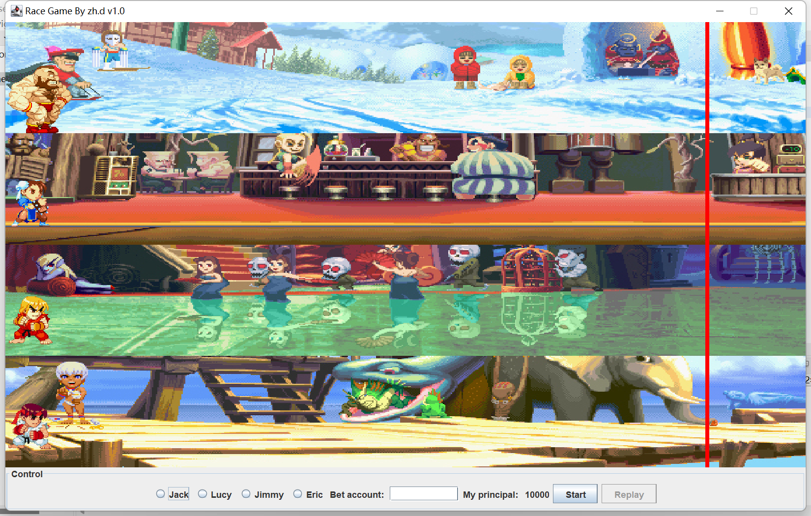
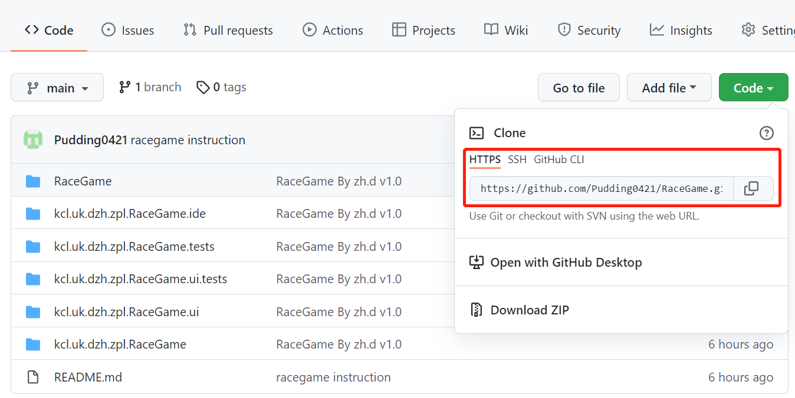
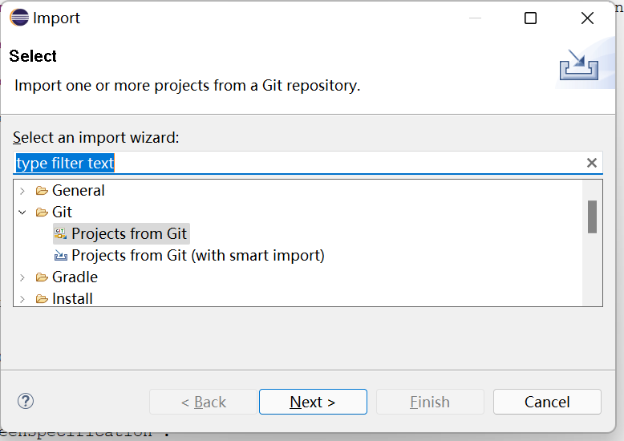
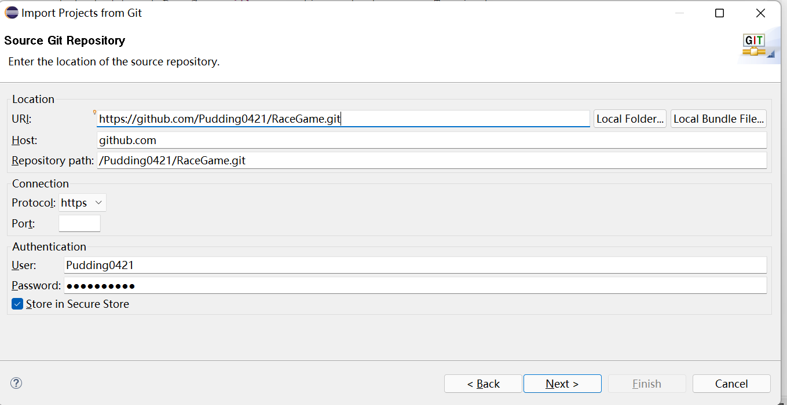

# RaceGame

It is 7CCSMMDD CourseWork 'RaceGame' belongs to GROUP 14.

## Description

This is a random game where winning depends on how lucky each person is. Before the game starts, you need to choose one of Jack, Lucy, Jimmy and Eric, and determine the bet amount (the initial definition of the principal is 10,000) to start the game by clicking 'Start'. When you want to start a new round of the game, click 'Replay'.



## Environment

- Development Environment: Eclipse
- Java version: Java 11

## Structure

These directories below are the main code codes of the project. If you want to run the program, you should import them into eclipse to run them as Eclipse Applications.

```
|-- kcl.uk.dzh.zpl.RaceGame
|-- kcl.uk.dzh.zpl.RaceGame.ide
|-- kcl.uk.dzh.zpl.RaceGame.tests
|-- kcl.uk.dzh.zpl.RaceGame.ui
|-- kcl.uk.dzh.zpl.RaceGame.ui.tests
```

Import the following demo code into runtime-eclipse and run RaceGame directly as a Java Application.

```
RaceGame
```

## Get Start

First, copy the link in Github.



Second, import the git project.



Third, copy the link to the red box location and enter your username and password.



Select these five files and import them.
|-- kcl.uk.dzh.zpl.RaceGame
|-- kcl.uk.dzh.zpl.RaceGame.ide
|-- kcl.uk.dzh.zpl.RaceGame.tests
|-- kcl.uk.dzh.zpl.RaceGame.ui
|-- kcl.uk.dzh.zpl.RaceGame.ui.tests
Finally, import 'RaceGame' into runtime.

## Finish

Congratulations you can start playing straight away! Go for it and good luck!